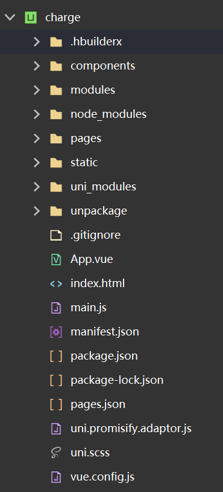
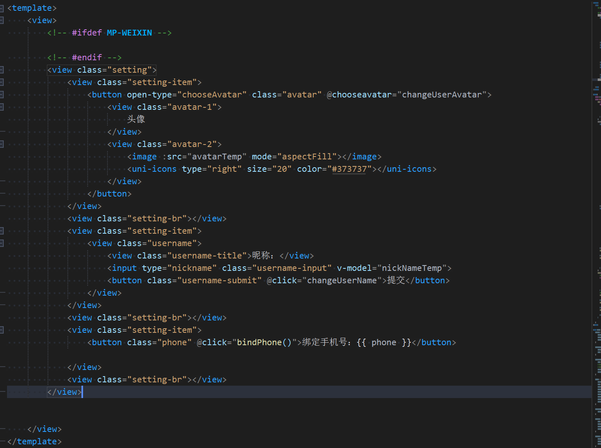
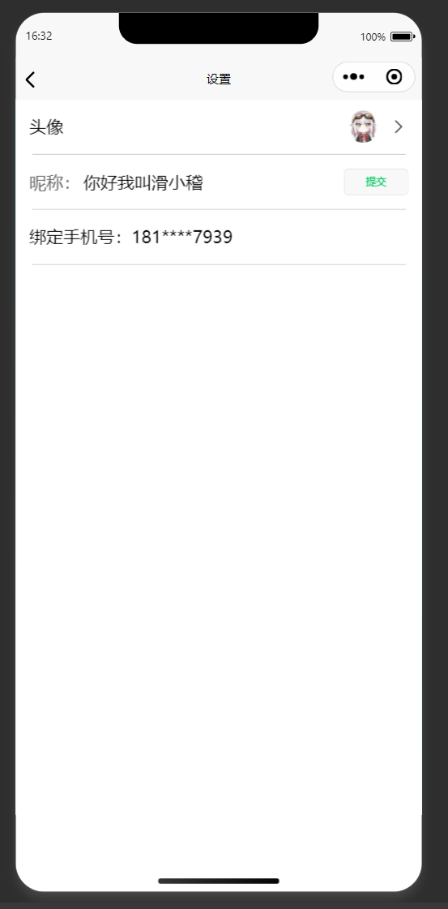
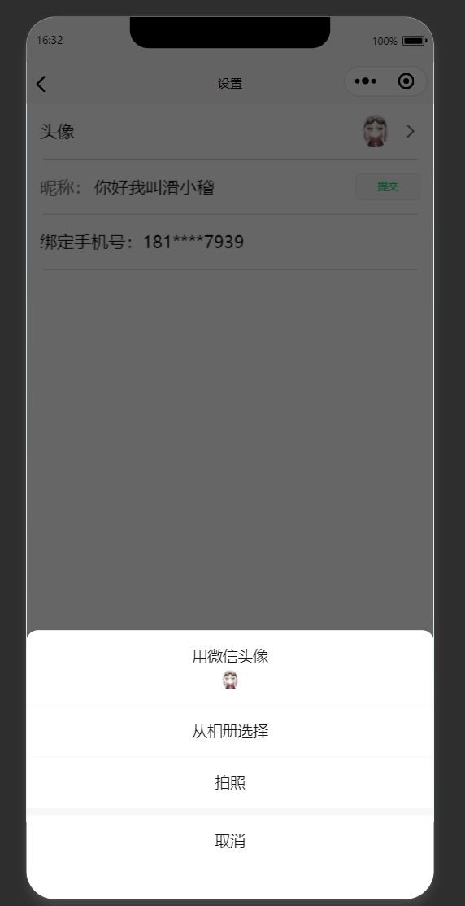
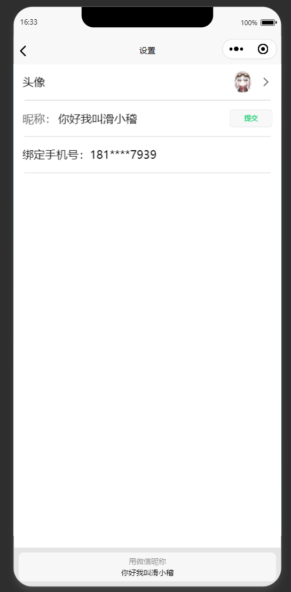

# 2024年夏季《移动软件开发》实验报告


<center>姓名：张世卿  学号：22020007145</center>


| 姓名和学号？         | 张世卿，22020007145                                    |
| -------------------- | ------------------------------------------------------ |
| 本实验属于哪门课程？ | 中国海洋大学24夏《移动软件开发》                       |
| 实验名称？           | 实验1：第一个微信小程序                                |
| 博客地址？           | https://blog.funny233.xyz/?p=299 |
| Github仓库地址？     | [OUC_WX_APP](https://github.com/woziji2200/OUC_WX_APP) |

（备注：将实验报告发布在博客、代码公开至 github 是 **加分项**，不是必须做的）


## **一、实验目标**

1、学习使用快速启动模板创建小程序的方法；2、学习不使用模板手动创建小程序的方法。


## 二、实验步骤

列出实验的关键步骤、代码解析、截图。

### 创建项目
之前用过Uniapp创建过一个项目里面包含这个功能，这里就展示曾经使用的方法

首先创建项目，选择空项目
```bash
vue create -p dcloudio/uni-preset-vue project-name
```
这里已经创建好了，看一下项目目录


### 编写代码

因为`getUserInfo`api已经被微信禁用了，所以我们使用新的方法获取用户头像和昵称


关键代码解析
```html
<button open-type="chooseAvatar" class="avatar" @chooseavatar="changeUserAvatar">
<!-- open-type="chooseAvatar" 规定了点击按钮会让用户选择头像 -->

<input type="nickname" class="username-input" v-model="nickNameTemp">
<!-- type="nickname" 规定了点击输入框会弹出“使用微信昵称” -->
```
相对应的处理函数
```js
async changeUserAvatar(e) { // 修改头像
    console.log(e);
    this.userInfo.avaterUrl = e.detail.avatarUrl
    this.avatarTemp = e.detail.avatarUrl // 这个是头像url
    console.log(this.userInfo.avaterUrl);
    uni.uploadFile({ // 先上传文件
        url: baseUrl + 'wx/image/',
        filePath: e.detail.avatarUrl,
        name: 'image',
        header: {
            "Authorization": 'Bearer ' + uni.getStorageSync('login').access_token  // 后端token，因为uploadFile函数没封装，所以就单独写一次token吧
        },
        success: async (res) => {
            // 获取上传的URL
            console.log(res);

            //然后再把这个URL设置为用户头像
            try {
                let res2 = await request('wx/avatar/', 'POST', { image_url: JSON.parse(res.data).image_url })
                uni.showToast({ icon: 'success', title: '上传成功' })
            } catch(e) {
                uni.showToast({ icon: 'error', title: '上传失败' })
                console.error(e)
            }

        },
        fail: (err) => {
            console.error(err);
            uni.showToast({ icon: 'error', title: '上传失败' })
        }
    })
}

async changeUserName() { // 修改用户名
    if (true) {
        this.userInfo.nickName = this.nickNameTemp
        let res = await request('wx/nickname/', 'POST', { nickname: this.nickNameTemp }) // 把用户名传到后端
        if (res.statusCode == 200) {
            uni.showToast({
                title: '修改成功'
            })
        } else {
            uni.showToast({
                title: '修改失败',
                icon: 'none'
            })
        }
    }
}
```
## 三、程序运行结果

列出程序的最终运行结果及截图。







## 四、问题总结与体会
### 问题总结
因为微信已经禁用了getUserInfo api，所以我们查询相关文档，发现 https://developers.weixin.qq.com/miniprogram/dev/framework/open-ability/userProfile.html 中提到了 头像昵称填写能力，我们使用这个方法就可以让用户快速填写头像和昵称。

### 体会
学会了创建微信小程序项目，通过对比uniapp和微信原生小程序，学会了Uniapp的编译过程，对原生Api的理解更加深刻